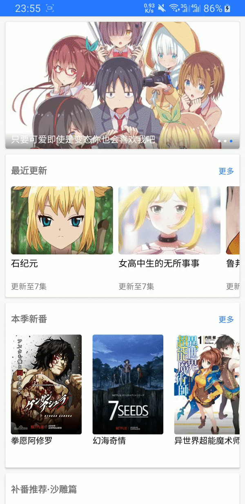

  

# Bangumi
一个追番和看番的Android应用  

# 说明  
这是一个自学Android新手的练习项目; 
打包好的apk已放在release文件夹下, 感兴趣的朋友可以下载体验一下。  

# 功能
- 视频本地缓存
- 追番
- 主页切换
- 滑动调节亮度, 音量, 进度
- 视频调速

# 支持网站
- [zzzfun](http://www.zzzfun.com/)
- [dilidili](http://www.dilidili.name/)
- [樱花动漫](http://www.imomoe.io/)
- [nico动漫](http://www.nicotv.me/dongman)  
- [silisili](http://www.silisili.me/)
- [奇米奇米](http://www.qimiqimi.co/)

# 使用了&感谢以下开源项目
- [playerbase](https://github.com/jiajunhui/PlayerBase)
- [ijkplayer](https://github.com/bilibili/ijkplayer)
- [okhttp](https://github.com/square/okhttp)
- [rxjava2](https://github.com/ReactiveX/RxJava)
- [rxandroid](https://github.com/ReactiveX/RxAndroid)
- [jsoup](https://github.com/jhy/jsoup)
- [glide](https://github.com/bumptech/glide)
- [gson](https://github.com/google/gson)  

# TODO
- [ ] 记录看到集数和进度
- [x] 重力感应旋转屏幕
- [ ] 自定义下载目录
- [ ] 多任务下载
- [x] 加入弹幕

# 应用截图  

  
 
 
 
 
 
  
 
 

